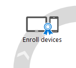
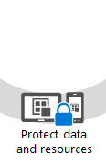

# Documentation for Microsoft Intune &lt;test 1&gt;
Intune can help your users get more work done, and work the way they want to work, while helping you protect the data and devices they work with. The Intune documentation will show you how to do that.

But you may also have some questions about how Intune fits in with other parts of your job. Here are some resources to help answer:

- **How does Intune help me support enterprise mobility?** There are several [ways to do enterprise mobility](https://technet.microsoft.com/library/dn957912.aspx) with Intune, depending on your comapny size, current management infrastructure, and need to scale. Intune is one part of the [Enterprise Mobility Suite (EMS)](http://www.microsoft.com/en-us/server-cloud/enterprise-mobility/overview.aspx). You can use it by itself, or combine it with Azure Active Directory Premium, Azure Rights Management, and Microsoft Advanced Threat Analytics to provide comprehensive protection for your users and devices.

- **What should I plan for if I want to let employees bring their own devices to work?** The [Bring Your Own Device (BYOD) Design Considerations Guide](https://technet.microsoft.com/en-us/library/dn656905.aspx) was developed to help systems architects and designers plan for a mobile workforce.

- **What should I tell employees about how to use their personal devices to  access email, files, and internal sites?** Letting employees use their own  mobile devices can make them very productive, but it helps  everyone to have a clear understanding of their responsibility to protect company data. Employees also want to know how secure their personal information is going to be as well. Check out the [end-user enrollment guide](http://aka.ms/b3ml2) for material to help you have this conversation.

- **Why would I want to use Intune with Configuration Manager?** If you're already using System Center Configuration Manager to manage your company's PCs, Macs, and UNIX/Linux devices, adding an Intune connector lets you [easily manage all your mobile devices in one console](https://technet.microsoft.com/en-US/library/mt243476.aspx).

## Introduction to Intune
The [introduction to Intune](https://technet.microsoft.com/library/dn646960%28TechNet.10%29.aspx) section give you an overview of the  capabilities the Intune service provides. Here you’ll find information about how to fit Intune into your business, and considerations to take before you test drive Intune.

## Get started
In [get started](https://technet.microsoft.com/library/dn646953%28TechNet.10%29.aspx) you'll find walkthrough guides to get you familiar with the Intune environment and even set up your first pilot. You'll also find a template you can customize and give to your users to tell them what to expect with Intune.

## Enroll devices
Today's mobile device management (MDM) strategies deal with variety of phones and tables (iOS, Android, Windows). Whether users are bringing their own devices (BYOD) into management to get company mail and data or you're distributing company-owned devices (COD), the first step is to [set up device enrollment](https://technet.microsoft.com/library/dn646962%28TechNet.10%29.aspx). You can also manage computers either by enrolling them with Intune (MDM) or by installing the Intune client software.

## Configure and manage devices
To enable productivity, you need to prepare both devices and apps. In [configure and manage devices](https://technet.microsoft.com/library/mt313202%28TechNet.10%29.aspx), you’ll create policies to control how your users can get to your VPN, WiFi, and email.

Should users have passwords on devices that have company data? You can require one. Are there apps you don't want them to use? You can block them. Try these polices out before you enroll your test clients, and then keep tweaking and tuning as you roll out to all your users.

## Deploy and manage apps
In [deploy and manage  apps](https://technet.microsoft.com/library/dn646965%28TechNet.10%29.aspx) you'll learn how to deliver all kinds of apps to your users -- Store apps, web apps, in-house apps -- and how to update them and get rid of them when you don't need them anymore.

## Protect data and devices
It's all about the data. You need to give users access, but you want to make sure they don't do the wrong thing, accidently or on purpose. In [protect data and devices](https://technet.microsoft.com/library/mt313203%28TechNet.10%29.aspx), you'll see how Intune gives you a way to stop users from getting something they really want -- email, for example -- unless their devices meet requirements you set. You'll also see how multifactor authentication can help stop the wrong people from stealing your data, and how to use apps to stop your data from leaking.

## Retire data and devices
When devices get lost or stolen, when employees move on to other jobs, or when hardware needs to be replaced, you need to be able to remove apps and data from devices, retire devices, or revoke access. These scenarios are laid out in [retire data and devices from management](https://technet.microsoft.com/library/mt313204%28TechNet.10%29.aspx).

## Technical reference
No technical documentation would be complete without [technical reference](https://technet.microsoft.com/library/mt282239%28TechNet.10%29.aspx) topics covering features.

## Additional resources

- [What's new in Microsoft Intune](../Topic/What_s_new_in_Microsoft_Intune.md)

- [Release notes for Microsoft Intune](../Topic/Release_notes_for_Microsoft_Intune.md)

- Connect with the [!INCLUDE[wit_nextref](../Token/wit_nextref_md.md)] community:

   - [Read the latest news](http://blogs.technet.com/b/microsoftintune/) in the Intune blog. [Follow Intune](https://twitter.com/MSIntune) on Twitter. [Ask a question](http://go.microsoft.com/fwlink/?LinkID=232998) in the Intune forums.

- [Find out how to get support for Intune](http://technet.microsoft.com/library/dn646963.aspx#OPEN)

