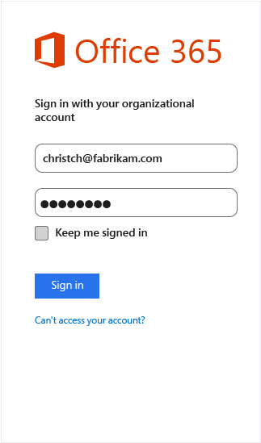
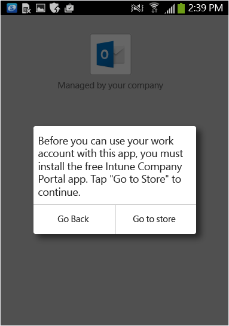
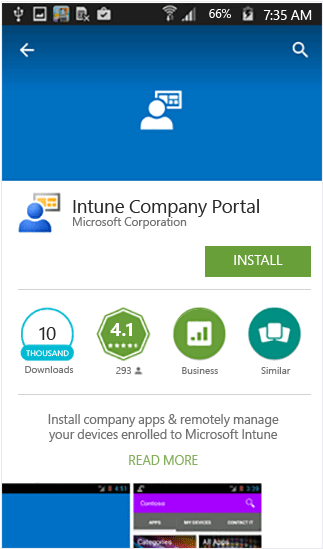
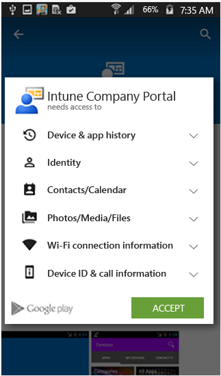
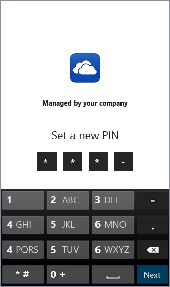
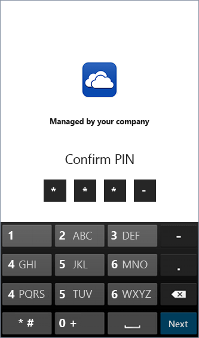
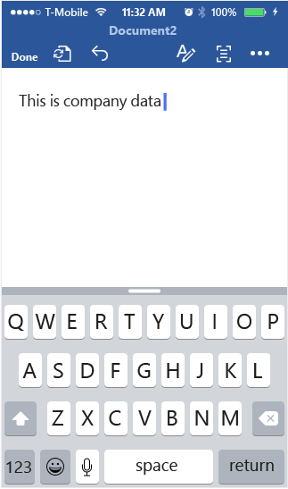
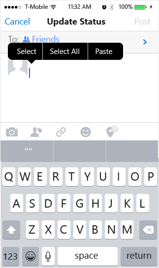
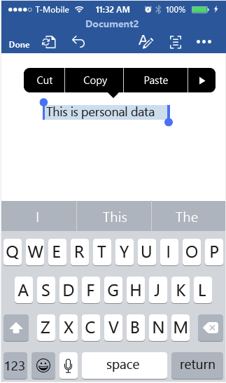
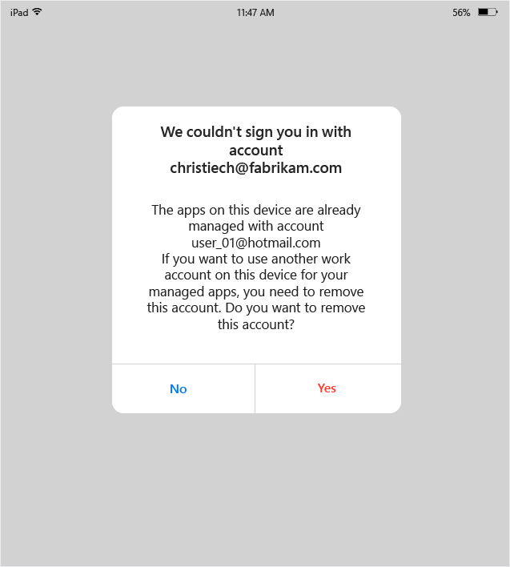

Mobile application management (MAM) polices are applied only when apps are used in the work context.  Read the following scenarios to help you educate your users so that they understand how managed apps work.

**In this topic**

[Scenario: Access OneDrive on an iOS device](#bkmk_OneDriveiOS)

[Scenario: Accessing OneDrive on an Android device](#bkmk_OneDriveAndroid)

[Scenario: Microsoft Word app for work and personal tasks](#bkmk_wordworkandpersonal)

##### Scenario: Accessing OneDrive on an iOS device

1. Launch the  **OneDrive** app to open the sign in page.

   

   > [!NOTE]
   > On a personal device, typically the end-user would download the app.  If the device is managed by a MDM solution, your can deploy the app to the device.

2. Type your work account user name. You are redirected to the **O365 authentication** page to enter your work credentials.

   

3. After your credentials are successfully authenticated  by Azure AD, the MAM polices are applied, and you will be asked to restart the **OneDrive** app.

   

4. When you relaunch the **OneDrive** app, the app launches with the MAM policies turned on. You are now prompted to set a **PIN** for the app. (if you configured the policy for this).

   

5. Once you set the PIN and confirm,  you are able to access the files on your **OneDrive for Business**.

   

   > [!NOTE]
   > When you change a deployed policy, the changes will be applied next time you open the app.

##### Scenario: Accessing OneDrive on an Android device

1. Launch the OneDrive app to open the sign in page.

   > [!NOTE]
   > On a personal device, typically the end-user would download the app.  If the device is managed by a MDM solution, you can deploy the app to the device.

2. Type your work account user name. You are redirected to the **O365 authentication** page to enter your work credentials.

   

3. Once your credentials are successfully authenticated by **Azure AD**, you should see a message displayed with instructions to install the company portal app, if it is not already installed on the device.  Tap on **Get the app** to proceed.

   

4. You are now in the **Google Play** store where you can download and install the **Company Portal** app.

   The Company Portal app helps keep the data secure and protected.

   

5. Once you have completed the install, click **Accept** to accept the terms.

   

6. The **OneDrive** app launches automatically.

7. The next time you open OneDrive, you will see the prompt to set a **PIN**, provided the policy settings are set to require a PIN to access the **OneDrive** app.

   

8. Once the PIN is set and confirmed, you can continue using **OneDrive**, which is now managed by app policies.

   

##### Scenario: Using Microsoft Word app for work and personal tasks

1. Open the **Word** app on your device. We are using an iOS device to show the steps.

2. Tap **New** to create a new word document.

   

3. Type a sentence or two.  When you save this document, both personal and work locations are shown as options to save the document you just created.  At this step, the app policies are not yet applied since this work/personal context is not yet established.

4. Save the document to your OneDrive for business location. This is now tagged as company data and the policy restrictions apply.

   

5. Open the document you saved to your work location.  Copy the text, open your personal**Facebook** account  and try to paste the copied text.  You see that you cannot paste the content into the new Facebook post. The paste option is not greyed out, but nothing happens when you press **Paste**.

   

   

6. Now repeat steps 2 and 3 to create another new document, type a sentence or two, and instead of saving it to your work, save it to your personal location, like **OneDrive - personal**.

   

7. Open the personal saved document.  Copy the text, open the **Facebook** app and try to paste the copied text. You see that you are able to paste the content to a Facebook post.

   

### Changing a user account on a device
For OneDrive and Outlook apps, you can only use one work account that has a MAM policy on a device.  Adding multiple work accounts are blocked on these apps.  You can however, remove a user and add a different user on the device.

If you are using an iOS device, when you try to add a second work account on the same device, you will see a blocking message.  You will also see an option to remove the existing account and add a new one. You can do so by clicking **Yes**.

If you are using an Android device, You will see a blocking message with instructions to remove the existing account and add a new one.  On Android devices, to remove the existing account, go to **Settings &gt;General &gt; Application Manager &gt;Company Portal and select "Clear Data"**.

## See Also
[Create and deploy mobile app management policies with Microsoft Intune](../Topic/Create_and_deploy_mobile_app_management_policies_with_Microsoft_Intune.md)

