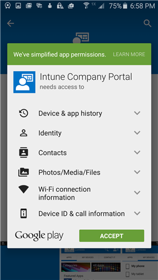
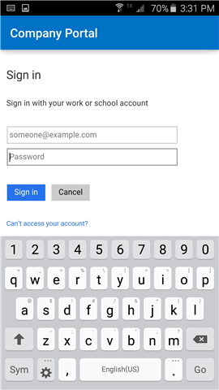
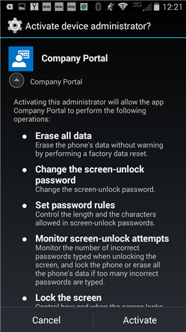
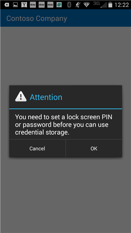
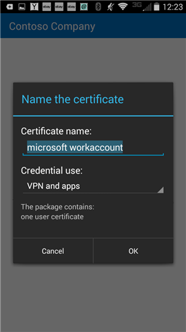
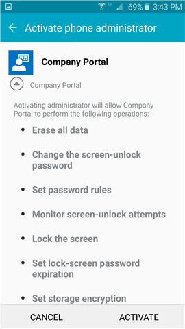
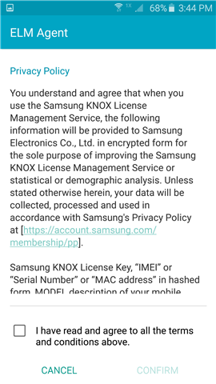
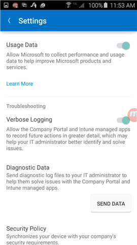

# Using your Android device with Intune
Use these  steps for tasks that you need to do on your Android device when your company is using Microsoft Intune:

|Task category    |Tasks you can do    |
|-----------------|--------------------|
|Company Portal app installation and Intune enrollment    |<ul><li>[Install the Microsoft Intune Company Portal app](#BKMK_andr_install_cp_app) </li><li>[Sign in to the Company Portal](#BKMK_andr_signin_cp) </li><li>[Enroll your device in Intune](#BKMK_andr_enroll_devc) </li><li>[What happens when I install the Company Portal app and enroll my device in Intune?](#BKMK_andr_what_happs_add) </li> </ul>|
|Things you can do when your device is enrolled in Intune    |<ul><li>[What is the Company Portal website and what can I do with it?](#BKMK_andr_whatis_cp_website) </li><li>[Use managed apps on your device](#BKMK_andr_use_mgd_apps) </li><li>[Encrypt your device](#BKMK_andr_encrypt_your_device) </li><li>[Set your PIN or password](#BKMK_andr_set_pin) </li><li>[Install your company's Virtual Private Network (VPN)](#BKMK_andr_install_vpn) </li><li>[Reset (erase) your lost or stolen device](#BKMK_andr_erase_lost_device) </li><li>[Turn off Microsoft usage data collection](#BKMK_andr_data_collect) </li><li>[Unenroll your device from Intune](#BKMK_andr_unenroll_device) </li><li>[What happens when you unenroll your device from Intune and uninstall the Company Portal app?](#BKMK_andr_what_happs_unenroll) </li> </ul>|
|Fix issues with your device    |<ul><li>[Use Verbose Logging to help your IT admin fix issues](#BKMK_andr_verboselogging) </li><li>[Send diagnostic data logs to your IT admin using email](#BKMK_andr_send_diag_logs) </li><li>[Send diagnostic data logs to your IT admin using a USB cable](#BKMK_andr_send_diag_usbcable) </li><li>[Send enrollment errors to your IT admin](#BKMK_andr_send_enroll_errors) </li><li>[Device doesn't have the required minimum operating system version](#BKMK_andr_no_min_os) </li><li>[Device doesn't comply with the maximum operating system version](#BKMK_andr_no_max_os) </li> </ul>|

## Install the Microsoft Intune Company Portal app
The Company Portal is an app that you install on your device to give you access to your company or school apps, email, and network.  Before you can get access, you have to install the Company Portal app, and then  use the app to enroll your device in Microsoft Intune. To find out more about what enrolling means, see [What happens when I install the Company Portal app and enroll my device in Intune?](#BKMK_andr_what_happs_add).

1. Tap **Home** &gt; **Play Store**.

2. In the **Search** box, type **company portal**.

3. Tap **Intune Company Portal**.

   

4. Tap **INSTALL**.

   

5. Tap **ACCEPT**.

   

## Sign in to the Company Portal
After you install the Company Portal app, you'll need to sign in to the app to enroll your device in Intune. Once you enroll, you can  sign in to the Company Portal anytime to download company apps and do other tasks. For more about what you can do, see [What happens when I install the Company Portal app and enroll my device in Intune?](#BKMK_andr_what_happs_add).

1. Tap **Company Portal** in your list of apps.

   

2. On the **Welcome** screen, tap **Sign in**.

   

3. Enter your work or school email and your password, and then Tap **Sign in**.

   

   If you are signing into the Company Portal for the first time, and your company or school is using Intune, you will be prompted to enroll your device in Intune. To enroll, follow the steps in [Enroll your device in Intune](#BKMK_andr_enroll_devc).

## Enroll your device in Intune
When you enroll your device in Intune, you can access the company’s network, and get your work email,  work files, and company apps. To find out more about what you can do when you enroll, see [What happens when I install the Company Portal app and enroll my device in Intune?](#BKMK_andr_what_happs_add). If you have issues while trying to enroll, see [Send enrollment errors to your IT admin](#BKMK_andr_send_enroll_errors).

To enroll, use the steps that match the type of device you have:

- [Enroll your native (non-Samsung device in Intune)](#BKMK_andr_enroll_native)

- [Enroll your Samsung Knox device in Intune](#BKMK_andr_enroll_knox)

### Enroll your native (not a Samsung Knox) device in Intune
The instructions for enrolling are different for a Samsung Knox Android device versus a "native," non-Samsung Knox Android device. To determine if you have a Samsung Knox device, go to **Settings** &gt; **About phone**. If you don't see the word  "Knox" listed there, follow these enrollment instructions.

1. On the Company Portal **Welcome** screen, tap **Sign in**, and then sign in with your work or school account.

   

2. If your IT admin set up company terms and conditions, tap **ACCEPT** to accept the terms.

   

3. Tap **ENROLL**.

   

4. Tap **Activate**.

   

5. Follow the prompts to enter a PIN or password. If you already set up a PIN or password on this device, you won't see this screen or be required to enter a new PIN or password.

   

6. On the  **Name the certificate** screen, tap **OK** to accept the default certificate.

   

   Your device is now enrolled in Intune.

If you get an error while trying to enroll your device in Intune, see [Send enrollment errors to your IT admin](#BKMK_andr_send_enroll_errors).

### Enroll your Samsung Knox device in Intune
To determine if you have a Samsung Knox device, go to **Settings** &gt; **About phone**. If you see "Knox" listed there, you have a Samsung Knox device.

1. On the Company Portal Welcome screen, tap **Sign in**, and then sign in with your work or school account.

   

2. If your IT admin set up company terms and conditions, tap **ACCEPT** to accept the terms.

   

3. Tap **ENROLL**.

   

4. Tap **ACTIVATE**.

   

5. Accept the Samsung Knox Privacy Policy and tap **CONFIRM**.

   

Your device is now enrolled in Intune.

## What happens when I install the Company Portal app and enroll my device in Intune?
You start by installing the Company Portal app, and then use the app to enroll your device in Intune. Once your device is enrolled, you  can use the Company Portal app to:

- Access the company network, email, and work files

- Get company apps from the Company Portal app or Company Portal website

- Automatically configure your company email account

- Reset your phone to factory settings if it is lost or stolen

When  you enroll your device in Intune, you are giving your IT administrator permission to manage your device to help protect the company information on the device.

|IT cannot see    |IT can see    |
|-----------------|--------------|
|<ul><li>Call history </li><li>Text messages </li><li>Personal email, contacts, and calendar </li><li>Web history </li><li>Location </li><li>Camera roll </li><li>Personal data </li> </ul>|<ul><li>Owner </li><li>Device name </li><li>Serial number </li><li>Manufacturer </li><li>Model </li><li>Operating system </li><li>Company apps </li><li>Personal apps </li> </ul>|
When you add your Android device, you are giving your IT administrator permission to access the device. They can do things like:

- Reset your device back to manufacturer’s defaults. This is helpful if the device is lost or stolen.

- Remove all company related data. Your personal data and settings aren’t removed.

- Force you to have a password or PIN on the device, which may lock you out of the device, or reset your device back to manufacturer’s default settings, which may include the deletion of data, if there are too many incorrect password attempts.

- Require you to accept terms and conditions.

- Enable or disable the camera on your device.

- Force all the data, including corporate and personal data, on the device to be encrypted. This helps protect the data if the device is lost or stolen.

- After your device is added to the Company Portal, approximately every 8 hours it will:

   - Download any policy or app updates that your IT administrator has made available.

   - Send any hardware inventory updates (these updates do not contain personal information).

   - Send any company app inventory updates (these updates do not contain personal information).

## What happens if I reset my Android device using the Company Portal?
When you use the Company Portal to reset your personal device, some apps and settings on your device may be deleted, including some of your personal data. What happens on each device depends on the type of device you have and how you are using the device, as described in the following table.

|Device configuration and management    |Device type    |
|---------------------------------------|---------------|
|Your IT admin manages your mobile device    |**Android**    When you reset your Android device, the following happens:    <ul><li>Your device won’t appear in the company portal anymore. </li><li>Your company email account will be deleted and unsaved email will be deleted. </li> </ul>|
|Your device can access company email only    |**Android**    <ul><li>Your device won’t appear in the company portal anymore. </li><li>The company portal tries to reset the device back to the manufacturer’s defaults. All your personal data and settings will be removed. </li> </ul>|

## What is the Company Portal website and what can I do with it?
The [Company Portal website](http://portal.manage.microsoft.com) is your company’s web interface that you use to manage your work computers and devices, and your personal computers and devices that you choose to use at work. You can do most of the same tasks on this website that you can do by using the Company Portal app that you install on your device.

You can do the following tasks from the Company Portal website:

- Browse for and download company apps

- Rename your device

- Remove your device from Intune

- Reset your mobile device to its factory default settings

- Find contact information for your IT administrator

## Use managed apps on your device
Managed apps are apps that your IT administrator can configure to help protect company data that you can access in that app. When you access company data in a managed app, you may notice that the app works a little differently from what you expect. For example, you might not be able to copy and paste protected company data, or you might not be able to save that data to certain locations.

Different managed apps can also work together on your device to allow you to do your daily tasks, while keeping corporate data protected. For example, if you open a company file in one managed app, and another managed app is required to view that file, the managed app that allows you to view the file opens automatically. If a required app is not available, certain actions, like opening a document or accessing a web link from within a managed document, might not be available.

When you access company data in a managed app, you see a message like the one below, which lets you know that the app you are opening is managed.

### How do I get managed apps?
You get managed apps in a couple of different ways:

- When your device is enrolled in Microsoft Intune, you either install the app from your Company Portal app or Company Portal website, or your IT admin might install it on your device. To find out about enrollment, see [Enroll your device in Intune](#BKMK_andr_enroll_devc).

- You install an app from the Play Store and then sign in with your corporate user account that is managed by Intune.

### What can my IT admin manage in an app?
Here are some examples of options that your IT admin can manage in an app and that can affect your interactions with company data on your device:

- Access to specific websites

- Transfers of data between apps

- Saving files

- Copy and paste operations

- PIN access requirements

- Your login, using company credentials

- Ability to back up to the cloud

- Ability to take screenshots

- Data encryption requirements

Some common apps that your IT department might manage are:

- Managed web browser

- Managed image viewer

- Managed PDF viewer

- Managed AV player

- Microsoft Word, Excel, PowerPoint

Contact your IT admin for more information about the managed apps on your device.

## Encrypt your device
If your company or organization requires you to encrypt your device before you can access company files, email, or data, follow these steps to encrypt your device:

1. Ensure that your device is connected to the charger.

2. Tap **Search**. In the Search box, type **company portal**.

3. Ensure that a screen lock PIN or password has been set for your device.

4. In Settings, click **Security** &gt; **Encrypt Phone**.
   (On some phones, you’ll need to click **Storage** &gt; **Storage encryption**).

5. Follow the on-screen instructions. During encryption, your device might restart several times.

6. Ensure that your device is enrolled with Microsoft Intune by following the instructions in [Enroll your device in Microsoft Intune](../Topic/Enroll_your_device_in_Microsoft_Intune.md).

## Set your PIN or password

1. Tap  **Settings** &gt; **Security** &gt; **Screen Lock** &gt; **Password**.

2. Choose and confirm your new password.

3. Ensure that your device is enrolled with Microsoft Intune by following the instructions in [Enroll your device in Intune](#BKMK_andr_enroll_devc).

4. Tap **GET** &gt; **INSTALL**.

## Install your company's Virtual Private Network (VPN)
If your IT administrator has configured a VPN application to enable you to  connect to your company's resources, you'll see a notification on your device indicating that you need to install a VPN app. Follow these steps to install the VPN app:

1. Pull down the notification drawer, and tap **Tap to install this required app**.

2. In the **Play Store**, click **INSTALL** and follow the prompts to install the app.

3. Tap **Install corporate VPN profile** and follow the prompts to accept and activate the app.

## Reset (erase) your lost or stolen device
If your phone is lost or stolen, you can reset it to factory defaults.

> [!WARNING]
> Resetting a device to factor defaults removes both your personal and work information from it.

1. Open **portal.manage.microsoft.com** in your browser, and sign in to your work account.

2. Tap **My Devices** and select the name of the lost of stolen  device.

3. Click **Reset** &gt; **Reset**.

   > [!NOTE]
   > If you are unable to reset your lost or stolen device, ask your IT administrator to reset it for you.

## Turn off Microsoft usage data collection
In order to improve its products and services, Microsoft automatically collects anonymous data about the reliability and performance of the Company Portal app and how it is used. You can turn off the collection of that data by using the Usage Data setting in the Company Portal app. IT administrators have no control over the collection of the data, and they cannot change your selection for the setting.

## Unenroll your device from Intune and uninstall the Company Portal app
When you uninstall the Company Portal app, you are also unenrolling your device from Intune, which means that your device will no longer be able to access company resources.  For more about what happens when you unenroll, see [What happens when you unenroll your device from Intune and uninstall the Company Portal app?](#BKMK_andr_what_happs_unenroll).

Before you can uninstall the Company Portal app, you have to go to the **Device administrators** setting, and turn off **Company Portal**. The steps may differ a little, depending on which Android device you have.

To unenroll your device from Intune and uninstall the Company Portal app:

1. Go to **Settings** &gt; **Security &amp; Screen Lock** &gt; **Device administrators**.

   Completing this step immediately unenrolls your device.

2. Clear the check box next to, or turn off, **Company Portal**.

   You can now uninstall the Company Portal app.

## What happens when you unenroll your device from Intune and uninstall the Company Portal app?
When you unenroll your device from Intune:

- Your device won’t appear in the Company Portal anymore.

- You can’t install apps from the Company Portal anymore

- Any settings that were changed on your device when you added it, for example disabling the camera, or requiring a certain password length, will no longer apply.

- You might not have access to some company resources, such as file shares or internal web sites, on your device anymore.

- Devices that are configured for email only won't appear in the Company Portal app or website anymore.

## Fix issues with your device
Use this information to fix issues with your device when you're trying to install the Company Portal app, enroll your device in Intune, or if you've already enrolled in Intune.

### Use Verbose Logging to help your IT admin fix issues
When your device is enrolled in Intune, you can use the **Verbose Logging** setting to make the Company Portal app and Intune-managed apps record detailed logs about what's happening on your device. These logs help your IT admin fix any issues that you might have when you're using the Company Portal or an app that's managed by Intune. Verbose Logging is enabled on your device  by default, and the  logs that are sent to your IT admin  include your email address.

To turn **Verbose Logging** on or off, sign in to the Company Portal app using your work or school credentials, tap **Settings**, and tap the on/off button next to the **Verbose Logging** setting.

### Send diagnostic data logs to your IT admin using email
If you get an error while you're working with your school or company apps or while you're in the Company Portal app, you can send diagnostic data logs  to help your IT admin figure out and fix the error. To include all of the details in the logs, which will make it easier for your IT admin to figure out the issue, turn on Verbose Logging.

1. Open the Company Portal app.

2. Tap **Menu** &gt;  **Settings**.

   > [!NOTE]
   > **Menu** could be a software button or a hardware button, depending on the type of Android device you have.

3. Under **Diagnostic Data**, tap **Send Data**.

   

4. Follow the prompts to choose an email app to use for sending the logs to your IT admin. The app will create a pre-addressed email with all the logs attached.

### Send diagnostic data logs to your IT admin using a USB cable
If you're using a computer rather than a mobile device, and you want to send data logs to have your IT admin figure out and fix your issue, use these steps:

1. Before you start, make sure that you have your IT admin's email address. It is typically listed on your Company Portal website or in your Company Portal app.

2. Use a USB cable to connect your device to a computer.

3. On the computer, look for a directory that has the name of your phone. In that directory, find &lt;Android Device&gt;\Phone\Android\data\com.microsoft.windowsintune.companyportal\files\.

4. Attach all of the files to an email and send them to your IT admin.

### Send enrollment errors to your IT admin
If you get an error while trying to enroll your device in Intune, you can try enrolling again by tapping **Retry**, or send the error information to your IT admin in an email by tapping **Send info**. An email, addressed to your IT administrator, is automatically created and contains the logs that your IT admin needs to help troubleshoot your device.

### Device doesn't have the required minimum operating system version
Your device doesn’t meet the minimum operating system version required by your IT department. Before updating your device, check the current operating system version by tapping **Settings** &gt; **About phone**, and then check to see if an update is available for your device by tapping **Settings**, and then finding the update option.

### Device doesn't comply with the maximum operating system version
Your device does not comply with your IT admin's policy for the maximum version of the operating system. Contact your IT admin for help.

